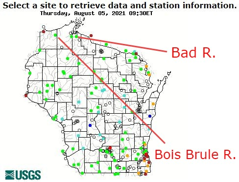

```{r echo=FALSE, eval=FALSE}
# Renders an appropriate HTML file for the webpage (CTRL-S and CTRL-ALT-R)
source(file.path(here::here(),"rhelpers/rhelpers.R"))
fnm <- "CE_1"
dnm <- "modules/Dates-Times"
modHTML(file.path(here::here(),dnm,fnm))
FSA::purl2(file.path(here::here(),dnm,paste0(fnm,".Rmd")),
           moreItems=c("opts_chunk","kable","row_spec"))
```
```{r echo=FALSE, results='hide', message=FALSE, warning=FALSE}
knitr::opts_chunk$set(echo=FALSE,results="hide",message=FALSE)
library(tidyverse)
library(lubridate)
```

----

## Stream Discharge
Follow the same descriptions as in the reading for obtaining stream discharge data for the Bois Brule and Bad Rivers in northern Wisconsin (see map below) for all of 2020.

```{r echo=FALSE, out.width='20%', fig.show='hold'}

```


Combine these data into one data frame and compute summary statistics by month for each river. Show your full code and results and comment on any observations that you can make from your summaries.

```{r}
wcd <- read_tsv("https://nwis.waterdata.usgs.gov/usa/nwis/uv/?cb_00045=on&cb_00060=on&format=rdb&site_no=040263205&period=&begin_date=2021-01-01&end_date=2021-08-03",
                comment="#")
wcd

wcd %<>%
  slice(-1) %>%
  select(-ends_with("cd"),-site_no) %>%
  rename(discharge=ends_with("00060"),
         precip=ends_with("00045")) %>%
  mutate(datetime=ymd_hm(datetime),
         discharge=as.numeric(discharge),
         precip=as.numeric(precip))
wcd
```
